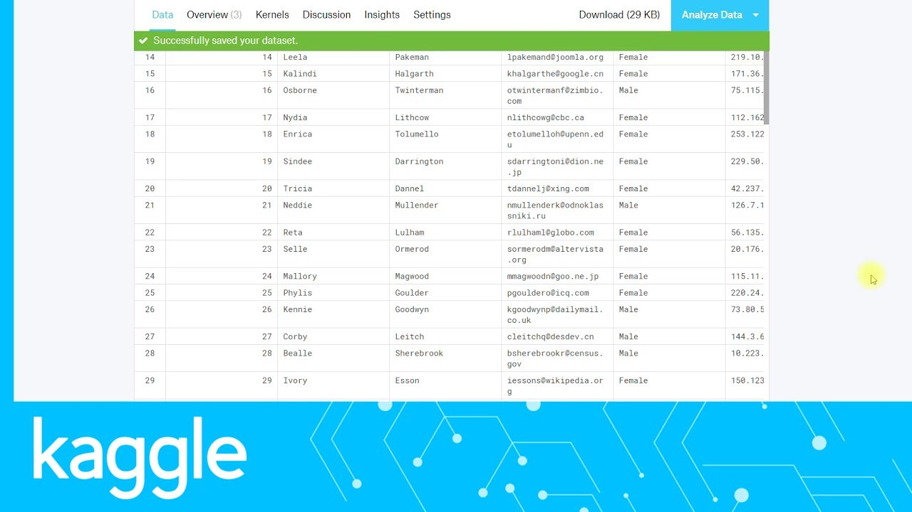
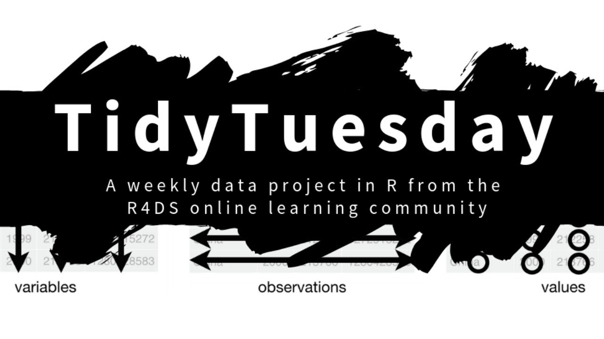

```{r setup, include=FALSE}
options(htmltools.dir.version = FALSE)
```
# Introduction
Data management is the practice of collecting, keeping, and using data securely, efficiently, and cost-effectively.

The goal of data management is to help people, organizations, and connected things optimize the use of data within the bounds of policy and regulation so that they can make decisions and take actions that maximize the benefit to the organization.

A robust data management strategy is becoming more important than ever as organizations increasingly rely on intangible assets to create value.
---
Data management has a wide scope, covering factors such as how to:

- Create, access, and update data across a diverse data tier
- Store data across multiple clouds and on premises
- Provide high availability and disaster recovery
- Use data in a growing variety of apps, analytics, and algorithms
- Ensure data privacy and security
- Archive and destroy data in accordance with retention schedules and compliance - requirements

**Actions or practices that contribute to effective storage, preservation and use of data and documentation throughout the research cycle, production cycle, operational cycle of an organization or entity.**
---
background-image: url(images/data_life_cycle.webp)
background-size: contain
---
## Big data
- Volume - Tremendous volumes - Petabytes

- Velocity - creation, storage, visualization, analysis

- Variety - Unstructured and structured

## Big Data Libraries
- Databases
  - tidy tuesday
  - Kaggle
---

### Research Data
Recorded factual materials commonly accepted in the research community as necessary to validate research findings. 

- Observational data

- Experimental data

- Simulation data

- Derived or compiled  data through data mining
---
# Why DATA MANAGEMENT

### Data Loss
 - Natural disasters- fires, floods
 - loss through THEFT
 - changing storage formats
 - changing storage devices

 
---
### Research Retraction

#### Retraction watch

Research papers, journal articles are sometimes retracted due to data validity questions and concerns

#### New Discoveries
- New discoveries can be included or added to existing projects
---

## Overall Benefits
1. Increasing the impact and visibility of research

2. Promotes innovation and new data uses

3. Leads to new collaborations

4. Maximizes transparency and accountability

---

## Related Issues
- Creating a plan for data management

- Managing data work flow

- Using data management best practices

- Creating consistent Metadata

- Sharing and getting credit for ones work

- Documenting Compliance
---
## Importance of well managed, Publicly Available data
- Enables Scrutiny of research findings

- Encourages validation of research methods

- Reduced the cost of duplicating data collection

- Providing resources for education and training
---
## Examples of publicly accessible data

## Github Repositories


---

## Kaggle


---

## Tidy Tuesday



---

##  Packages and Libraries
![Rkenya]images/(Rkenya.jpg)

---

5. Government Websites eg IEBC, KNBS, KEBS

6. DropBox (shared)

7. Google drive (shared)
---
## Data Types

### Numeric data
 - Continuous - 1, 5, 6 1.1, 3.6, 6.8, 4.1234
 
 - Integers - 1, 2, 5, -1, -4, -6
 
### Categorical Data
 - Characters - boy, man, chair, school, oxygen, computer
 
 - Factors - male & female, tall, medium & tall, vaccinated & unvaccinated
 
    - Nominal - Un-ordered factors
 
    - Ordinal Factors - Ordered factors, strongly agree, agree, neutral, disagree, strongly disagree

- Logical - TRUE & FALSE,  Yes & No
---
## Tidy Data
“Happy families are all alike; every unhappy family is unhappy in its own way.” –– Leo Tolstoy

“Tidy datasets are all alike, but every messy dataset is messy in its own way.” –– Hadley Wickham

### Tidy Data Principles
### A consistent way to organise your data

- Each variable must have its own column.

- Each observation must have its own row.

- Each value must have its own cell.

---

## Tidy Data

### Rectangular Data


- Variables == Columns

- Observations == rows

- Cases == cells or values
---
# Take Aways
### Before any data collection device a data management plan
 - An elaborate data collection procedure
 - A consistent and tidy data collection procedure
 - A data analysis plan
 - A publication or presentation plan - ready with an identified journal
 - A data storage procedure from data collection to final storage for further analysis
 

                  **ALWAYS REMEMBER DATA MANAGEMENT**
