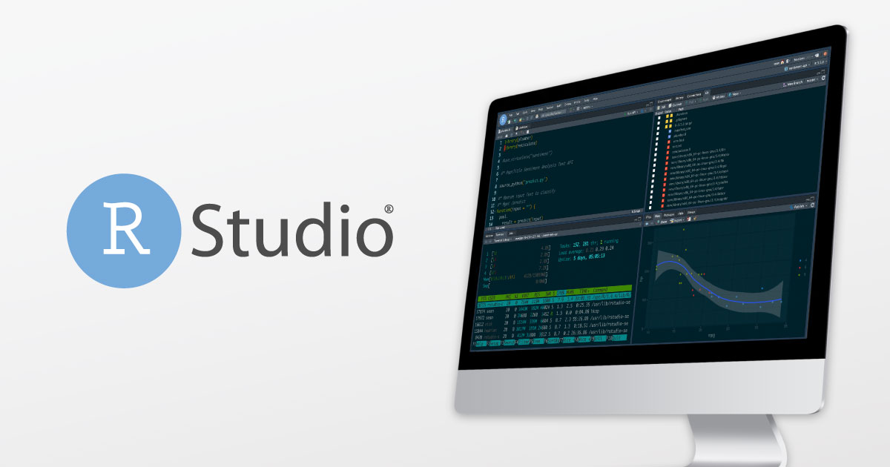

```{r setup, include=FALSE}
options(htmltools.dir.version = FALSE)
```

# Introduction

R is a programming language and software environment for statistical computing and graphics.

R is an integrated suite of software facilities for data manipulation, calculation and graphical display.

RStudio is an integrated development environment (IDE) for R. 

It includes a console, syntax-highlighting editor that supports direct code execution, as well as tools for plotting, history, debugging and workspace management.


---
.pull-left[
R - The Engine

]
.pull-right[
IDE - Dashboard

]

.pull-left[R

]

.pull-right[Rstudio

]

---

R Packages and Libraries as tools
.pull-left[
IDE - Rstudio

]
.pull-right[
App - Packages

]

---

background-image:url(images/hex-stickers.png)
background-size:contain

---

background-image:url(images/rstudio_session_4pane_layout.png)

background-size:cover

---

background-image:url(images/rstudioPanes.jpg)

background-size:contain

---

background-image:url(images/workflow.001.jpeg)
background-size:contain
---

background-image:url(images/what-exploratory-does.png)
background-size:contain

---
class: center, middle

.center[**LET US GET STARTED**]