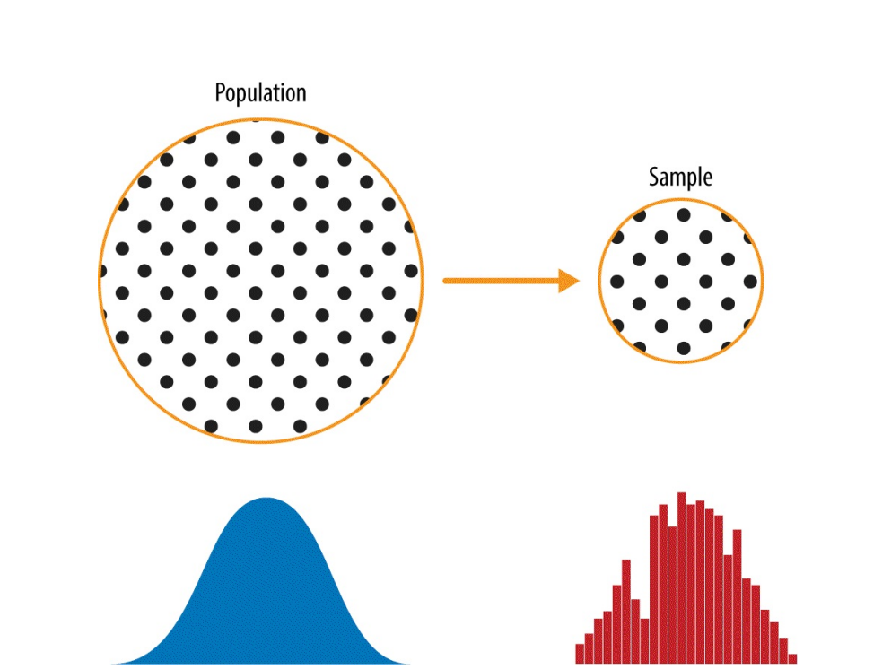
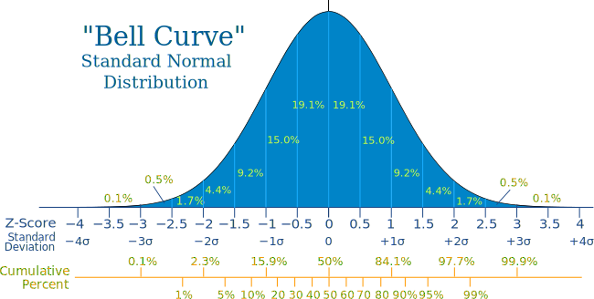
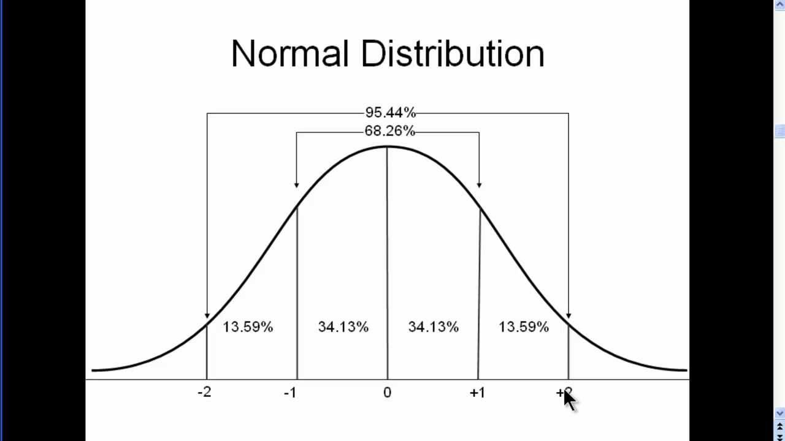
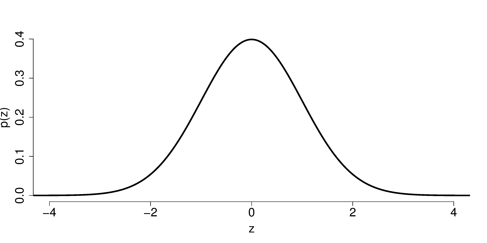
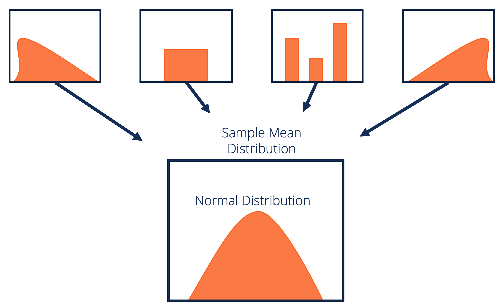

# Introduction
### Statistics
Statistics is the study and manipulation of data, including ways to sample, review, analyze, and draw inferences from data

The science of data collection, organizing, analysis, interpretation and presentation or dissemination of information gained

- Population - a collection of all outcomes, counts, responses, measurements of interest

- Sample - a representative subset of a population

- Parameters - attributes from all objects in a population

- Statistic - Attributes from a sample

---


---
# Descriptive Vs Inferential Statistics
### Descriptives
The organizing and summarizing of data by use of graphs and tables or numbers such as counts, means, medians, and modes

Exploratory data Analysis falls under this category of statistics

### Inferential Statistics
Refers to formal probability methods of drawing conclusions about a population using a sample.

Statistical inferences use probability to determine the level of confidence regarding the correctness of conclusions

Probability is the measure of randomness dealing with the chance or likelihood of an event occurring. 

With probability there is always a threshold from which we use to make our conclusions referred to as the critical or the alpha value. 
---

### Sampling Procedures and Methods

#### Probability sampling methods

- Random Sampling

- Stratified Sampling

- Clustered Sampling

- Systematic Sampling

- Multi-stage Sampling

#### Non-probability sampling methods

- Convenience Sampling

- Consecutive Sampling

- Purposive or Judgemental Sampling

- Quota sampling 
---
# Data Collection Methods
### Quantitative data collection methods
Outcomes of counting or measuring which can be discrete or continuous

continuous - 1.2, 3.4, 4.111

discrete - 1, 2, 10, 1000000, 100, 1200

#### Data collection methods
- Experimental

- Simulation

- Survey
 - A structured closed-ended interviews
 - Closed ended surveys and questionnaires
---
### Qualitative data collection methods
Categorizes or describes attributes of a population e.g poor, black, rich, short, small

#### Collection Methods
- Observation 
- Focus groups, 
- Observation
- Written records and 
- Individual interviews
---
# Data statistics
## Mean
The mean is the sum of all the values in a set, divided by the number of values. The mean of a whole population is usually denoted by µ, while the mean of a sample is usually denoted by x.

## Median

The median is the middle number of a set of numbers arranged in numerical order. If the number of values in a set is even, then the median is the sum of the two middle values, divided by 2.

## Mode

The mode is the most frequent value in a set. A set can have more than one mode; if it has two, it is said to be bimodal
---
# Dispersion

## Range

The range is the difference between the largest and smallest values of a set.

## Variance

The variance is a measure of how items are dispersed about their mean.

## Standard Deviation

The standard deviation σ (or s for a sample) is the square root of
the variance.

## Relative variability

The relative variability of a set is its standard deviation divided by its mean. The relative variability is useful for comparing several variances.
---
# Parametric Vs Non Parametric Methods
## Probility Distributions
There are two most important probability distributions in statistics

- Normal Distribution

- t- Distribution 

---
Normal distribution, also known as the Gaussian distribution, is a probability distribution that is symmetric about the mean, showing that data near the mean are more frequent in occurrence than data far from the mean. In graph form, normal distribution will appear as a bell curve.


---
The T distribution, also known as the Student's t-distribution, is a type of probability distribution that is similar to the normal distribution with its bell shape but has heavier tails. T distributions have a greater chance for extreme values than normal distributions, hence the fatter tails.

---

---
## Central Limit Theorem
The central limit theorem (CLT) states that the distribution of sample means approximates a normal distribution as the sample size gets larger, regardless of the population's distribution. Sample sizes equal to or greater than 30 are often considered sufficient for the CLT to hold.

---
### Central Limit Theorem
```{r}
library(TeachingDemos)
clt.examp(4)
```
---
## Statistical Tests for Drawing Inferences from Data
### Parametric Methods

Parametric statistical methods are carried out when the data fulfills certain criteria
 - Data must be Normally Distributed
 
 - Data must be randomly sampled
 
1. Student T-tests
    - One sample T - tests
    - Independent Two sample T - tests
    - Paired T - test
2. The Analysis of variance

3. Chi-Squared tests
    - Test of association/dependence
    - Test of good fit
4. Regression Analysis
---
## Non - Parametric Methods

- Wilcoxon ranked sum test

- Kruskal - Wallis

- Fisher's exact test


---

# Determining or Detecting Normality of data Distribution

1. Visual Method
 - creation of histograms
 - create a qqplot

2. Formal statistical tests
 - Perform a Shapiro-Wilk test
 - Perform a Perform a Kolmogorov-Smirnov Test

---

# Handling Non-Normal Data

1. Log Transformation: Transform the values from x to log(x).

2. Square Root Transformation: Transform the values from x to √x.

3. Cube Root Transformation: Transform the values from x to x1/3.

---
# Hypotheses Testing
A hypothesis is a hunch, guess, clue or an idea about a certain scenario

In statistics a hypothesis refers to a testable theory about data - A theory that can be falsified

Null Hypothesis vs Alternate hypothesis

### P values and critical values
A p-value is a statistical measurement used to validate a hypothesis against observed data.

There is always an established threshold for which a hypothesis is rejected or not rejected - The threshold is the critical value or the alpha value which is pre-determined or pre-provided

The alpha value could be;
- 10 %  == 0.01 ~ 90% confidence
- 5% == 0.05 ~ 95 % confidence
- 1% == 0.001 ~ 99% confidence

---
# Summary

## It is important to know that data analysis and inferences using data analysis is a process that starts with the;

 - Identification of the problem

 - Statement of the problem

 - Formulation of the objectives

 - Formulation of the hypotheses
---
 - Illustration of the expected outcomes

 - Formulation of data collection procedures and methods
 
 - identification of data analysis methods and statistical tools and tests
 
 - Drawing of inferences from the data 
 
 - Communication of the results
 
When any of the above process is broken it becomes very difficult to achieve the pre-determined objectives. 


                              *THANK YOU*

